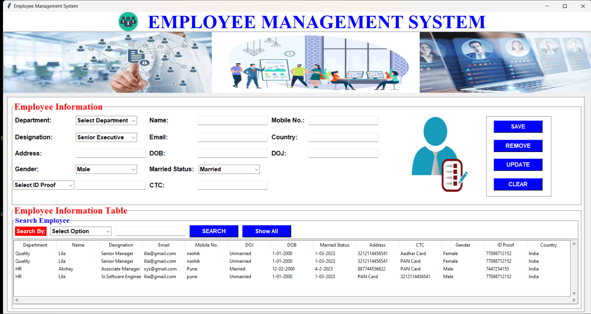
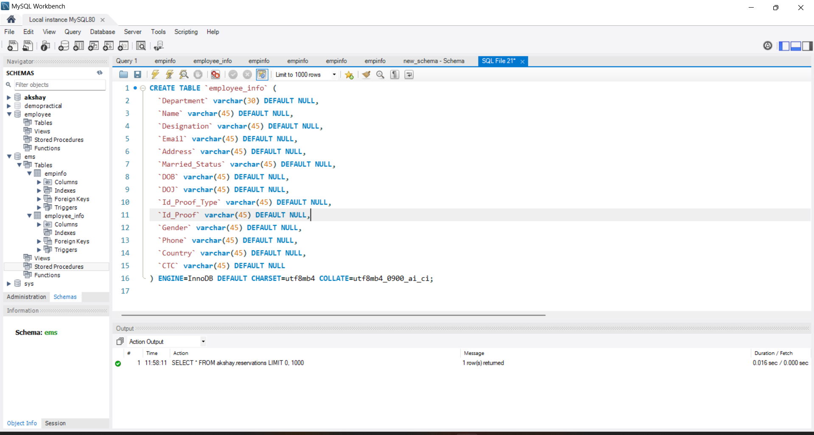
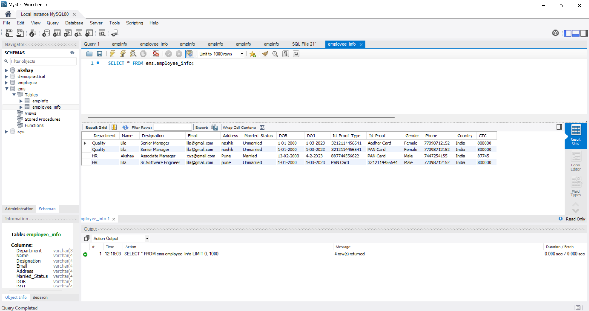

🚀 Employee Management System (MySQL)

A simple and efficient Employee Management System built using **MySQL** to manage employee records. It allows basic CRUD operations like adding, updating, viewing, and deleting employee data with a clean relational database structure.

🛠️ Features
➕ Add new employee records
🖊️ Update existing employee details
🗑️ Delete employee entries
📄 View all employee data in a structured format
📁 Clean relational database structure with primary & foreign key relationships

## 📸 Screenshots

### 🖥️ Dashboard View

### 🗃️ MySQL Table Schema

### 📊 Employee Table Data

